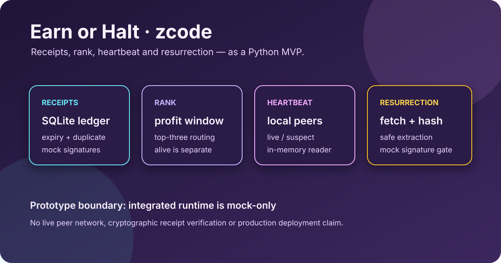

# Earn or Halt — zcode

[Runtime docs](docs/PHILOSOPHY.md) · [Claims and limits](docs/PROOFS.md) · [Nested arena](arena-v0.2.0/README.md) · [Upstream](https://github.com/meanwebuser/earn-or-halt-zcode)

> Explore the Earn or Halt lifecycle as a Python MVP: receipts, rank, local heartbeat state and release resurrection.

zcode is a prototype for separating economic signals from spendable balance.
Its modules make the lifecycle inspectable without pretending that a local
mock is a public protocol.

## What it provides

- Receipt dataclasses, SQLite ledger storage and duplicate/expiry guard paths.
- A 30-day profit window with top-three routing and separate alive status.
- Heartbeat reader and ejection state helpers for local peer simulations.
- Resurrection fetch, hash check and safe archive extraction helpers.
- An optional Solidity token and receipt-hash anchor surface, plus a nested
  arena v0.2 model with separate hardening tests.

## Verify from a clean machine

This command downloads the real upstream repository, installs its development
extras, runs the test suite and reaches the integrated mock runtime with a
self-contained temporary ledger:

~~~
git clone --depth 1 https://github.com/meanwebuser/earn-or-halt-zcode.git &&
cd earn-or-halt-zcode &&
python3 -m venv .venv &&
. .venv/bin/activate &&
python3 -m pip install -e '.[dev]' &&
PYTHONDONTWRITEBYTECODE=1 python3 -m pytest -q &&
zcode_tmp=$(mktemp -d) &&
mkdir -p "$zcode_tmp/data" &&
trap 'find "$zcode_tmp" -type f -delete; rmdir "$zcode_tmp/data" "$zcode_tmp"' EXIT &&
PYTHONDONTWRITEBYTECODE=1 PYTHONPATH=. python3 -m earn_or_halt.runtime \
  --mock --loops 1 --ledger "$zcode_tmp/data/ledger.sqlite3"
~~~

## Limits

The integrated runtime is mock-only and its heartbeat is in memory. Receipt
signatures and release signatures are placeholder checks, not production
ECDSA verification; live peer transport, on-chain settlement and RPC pointer
integration are absent. The nested v0.2 hardening model is not equivalent to
fully wired Solidity behavior. Read
[docs/PROOFS.md](docs/PROOFS.md) and
[arena-v0.2.0/docs/VERIFICATION.md](arena-v0.2.0/docs/VERIFICATION.md).
